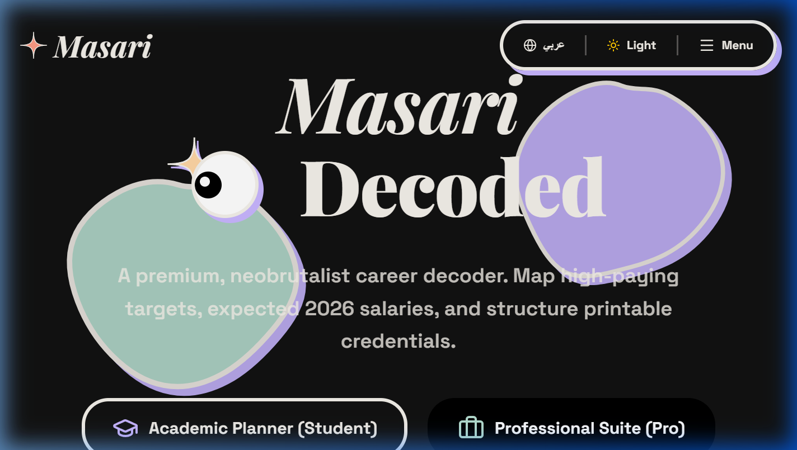

# 🧭 Masari - Academic & Professional Trajectory Advisor
> **Decentralized Neo-Brutalist Career Counselor Powered by Gemini 2.5 Flash**

Masari is a high-fidelity academic and career advisor platform built for students and professionals in the Kingdom of Saudi Arabia and beyond. Designed with a vibrant **Neo-Brutalist 3D design system**, it offers interactive tools, interactive eyeball-tracking, cursor magnetics, and 3D card physics, all connected to live-grounded generative models via the Google Gemini developer API.

---

## 📸 Platform Interface



---

## 🚀 Key Features

*   **🧠 RIASEC Diagnostic Career Test**: A 50-question interactive personality evaluation mapping scores to 100+ standard college majors. Includes a detailed AI-generated counseling summary.
*   **🏫 Saudi University Directory**: A comprehensive index of Saudi universities containing local rankings, difficulty scores, and admission thresholds (free). Includes an **AI Deep Search** targeting international universities and criteria (costs 5 points).
*   **📊 Live Salary Curve Predictor**: Web-grounded salary index searches (linked to Glassdoor/Payscale via Gemini search plugins) estimating salary forecasts in local currency based on major, skills, and target region.
*   **💳 Stripe Checkout Simulator & Sandbox**: Fully interactive mock payment portal mimicking real Stripe credit card checks and transactions to secure credits/upgrades.
*   **💬 AI Counselor Chatroom**: An interactive real-time counseling chat session answering academic and workplace progression queries.
*   **🛠️ Developer Debug Toolbar**: An integrated debug toolbar allowing developer profiles to instantly credit 100 points for verification.

---

## 🛠️ Tech Stack

*   **Frontend**: React (Vite), TailwindCSS, custom GPU-composited 3D CSS physics.
*   **Backend & DB**: Firebase Authentication & Firestore Cloud Database.
*   **AI Models**: Google Gemini 2.5 Flash via v1beta API endpoints.
*   **Search Grounding**: Google Search grounding tools configuration.
*   **Animations**: Magnetic wrappers, 3D card tilt triggers, and tracking eye physics.

---

## 📦 Installation & Setup

1.  **Clone the Repository**:
    ```bash
    git clone https://github.com/Moha2005269/masari-platform.git
    cd masari-platform
    ```

2.  **Install Dependencies**:
    ```bash
    npm install
    ```

3.  **Environment Variables**:
    Create a `.env` file in the root directory:
    ```env
    VITE_GEMINI_API_KEY=your_gemini_api_key_here
    VITE_FIREBASE_API_KEY=your_firebase_api_key
    VITE_FIREBASE_AUTH_DOMAIN=your_firebase_auth_domain
    VITE_FIREBASE_PROJECT_ID=your_firebase_project_id
    VITE_FIREBASE_STORAGE_BUCKET=your_firebase_storage_bucket
    VITE_FIREBASE_MESSAGING_SENDER_ID=your_firebase_messaging_sender_id
    VITE_FIREBASE_APP_ID=your_firebase_app_id
    ```

4.  **Run Development Server**:
    ```bash
    npm run dev
    ```

5.  **Build Production Bundle**:
    ```bash
    npm run build
    ```

---

<br>

# 🧭 منصة مساري - مستشار المسارات الأكاديمية والمهنية
> **منصة تفاعلية متميزة تعتمد على نموذج الذكاء الاصطناعي Gemini 2.5 Flash وتصميم نيو-بروتالست ثلاثي الأبعاد**

منصة **مساري** هي نظام مستشار أكاديمي ومهني متطور موجه للطلاب والمهنيين في المملكة العربية السعودية وخارجها. تم تصميمها بنظام جمالي قوي وجريء يعتمد على تأثيرات ثلاثية الأبعاد تفاعلية، مثل تتبع حركة الماوس بالعين، ومغناطيسية الأزرار، وتأثيرات الإمالة ثلاثية الأبعاد للبطاقات، مع ربطها مباشرة بنماذج التوليد الفورية عبر واجهة برمجة تطبيقات Google Gemini.

---

## 🚀 الميزات الرئيسية

*   **🧠 اختبار الميول المهنية RIASEC**: تقييم تفاعلي مكون من 50 سؤالاً يربط النتيجة بأكثر من 100 تخصص جامعي مع تقرير تحليلي مدعوم بالذكاء الاصطناعي.
*   **🏫 دليل الجامعات السعودية**: مرجع متكامل للجامعات السعودية يشمل نسب القبول والموزونة مجاناً، مع ميزة **البحث العميق بالذكاء الاصطناعي** للجامعات العالمية وشروط القبول (بقيمة 5 نقاط).
*   **📊 مؤشر رواتب وتوقعات سوق العمل**: محاكي رواتب مدعوم بأدوات بحث الويب الفورية لتقدير نطاقات الأجور بالعملات المحلية بناءً على التخصص، والمهارات، والمنطقة المستهدفة.
*   **💳 بوابة دفع افتراضية Stripe**: محاكي متكامل لعمليات الدفع والترقيات عبر بطاقات الائتمان لتجربة شحن النقاط وفتح الميزات.
*   **💬 غرف المحادثة مع المستشار الذكي**: دردشة ذكية تفاعلية فورية تقدم نصائح مهنية وتوجيهات عملية مدعومة بالذكاء الاصطناعي.
*   **🛠️ شريط تجربة المطورين**: شريط مخفي يتيح للمطورين شحن 100 نقطة مجانية فوراً لتسهيل اختبار الميزات.

---

## 🛠️ الأدوات والتقنيات

*   **الواجهة الأمامية**: React (Vite)، TailwindCSS، تأثيرات CSS ثلاثية الأبعاد مسرعة بالبطاقة الرسومية.
*   **قاعدة البيانات والهوية**: Firebase Authentication و Cloud Firestore.
*   **نماذج الذكاء الاصطناعي**: Google Gemini 2.5 Flash عبر نهايات v1beta.
*   **تغذية البحث الفوري**: مدمجة مع أدوات Google Search لتوفير بيانات حية موثقة.
*   **الحركة والتفاعل**: هياكل مغناطيسية، وتأثيرات حركة العين التفاعلية، وإمالة 3DTilt للبطاقات.
